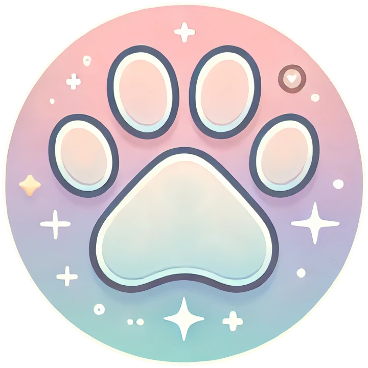
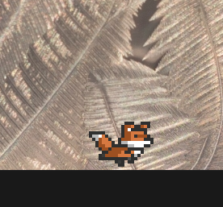
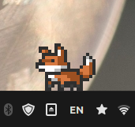

# QutyPal-Desktop

  

## Table of Contents

1. [About](#about)
2. [Credits](#сredits)

## About

It is a cross-platform desktop application built with Python and Qt6 that brings interactive, animated companions to your screen.

Inspired by classic shimeji characters, **QutyPal** is a fun way to bring your desktop to life.
Watch the companions move around, interact with you, and respond to your actions.

  
  

## What it does

- Wanders around your screen, moving here and there
- Likes to play with your mouse, so watch out, don’t get too close!
- Can be teased by scroll click on him
- Can be thrown into the air by dragging and dropping.

## Credits

- The base sprites for my Sebastian character come from [Elthen](https://www.patreon.com/elthen)'s [2D Pixel Art Fox Sprites](https://elthen.itch.io/2d-pixel-art-fox-sprites), which I then modify to suit my project.

